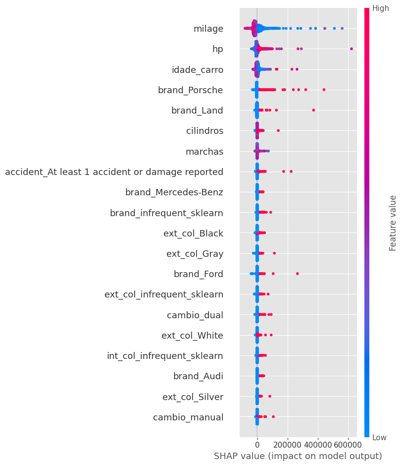
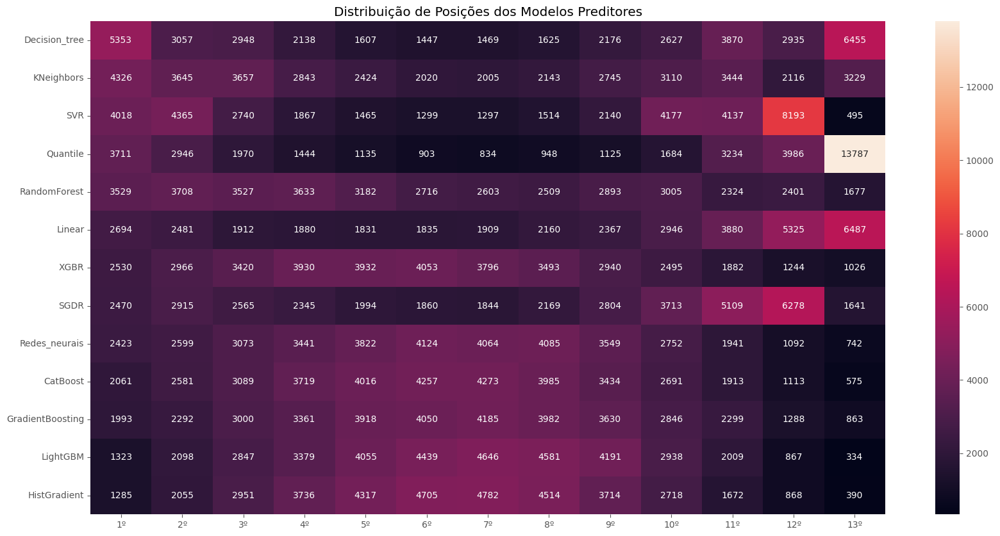

# Regression-of-Used-Car-Prices

## Objetivo

O objetivo desta competição é prever o preço de carros usados com base em vários atributos. Você deve criar um modelo que estime o preço de um carro dado um conjunto de características. O link para o conjunto de dados é [link](https://www.kaggle.com/competitions/playground-series-s4e9/overview)

## Avaliação
As submissões serão avaliadas com base na Raiz do Erro Quadrático Médio (RMSE). A fórmula para calcular o RMSE é a seguinte:


$$
\text{RMSE} = \sqrt{\frac{1}{N} \sum_{i=1}^{N} (y_i - \hat{y}_i)^2}
$$

Onde:

- `ŷ_i` é o valor previsto para a i-ésima instância
- `y_i` é o valor real para a i-ésima instância
- `N` é o número total de instâncias


## Arquivo de Submissão
Para cada ID no conjunto de teste, você deve prever o preço do carro. O arquivo de submissão deve conter um cabeçalho e seguir o formato abaixo:

```text
id,price
188533,43878.016
188534,43878.016
188535,43878.016
etc.
```

## Etapas

### Tratamento de Dados

**Foi aplicado os seguintes tratamentos ao conjunto de dados**

1. **Retirando IDs**
    - Remove a coluna `id` dos conjuntos de dados `train_x` e `test_x`.

2. **Criando a Coluna Cilindros**
    - Adiciona uma nova coluna representando o número de cilindros extraído dos dados da coluna `engine`.

3. **Criando a Coluna "HP"**
    - Cria uma coluna para a potência do motor (HP) extraída da coluna `engine`.

4. **Criando a Coluna "Marchas**
    - Adiciona uma coluna que representa o número de marchas do veículo extraído dos dados da coluna `transmission`.

5. **Criando a Coluna Idade dos Carros**
    - Cria uma coluna para a idade dos carros, calculada a partir dos dados da coluna `model_year`.

6. **Criando a Coluna Câmbio**
    - Adiciona uma coluna para o tipo de câmbio do veículo extraído dos dados da coluna `transmission`.

7. **Dropando Colunas**
    - Remove as colunas model, `model_year`, `model`, `engine`, `transmission` e `clean_title` dos conjuntos de dados.

8. **Imputação dos valores faltantes na Coluna Marchas"**
    - Preenche valores faltantes na coluna `marchas` utilizando um modelo de imputação treinado com as características `cambio`, `fuel_type`, `hp`, `idade_carro`,`cilindros`.

9. **Imputação dos valores faltantes na Coluna HP"**
    - Preenche valores faltantes na coluna `HP` utilizando um modelo de imputação treinado com as características `cambio`, `fuel_type`, `marchas`, `idade_carro`,`cilindros`.

10. **Imputação dos valores faltantes na Coluna cilindros"**
    - Preenche valores faltantes na coluna `cilindros` utilizando um modelo de imputação treinado com as características `cambio`, `fuel_type`, `marchas`, `idade_carro`,`HP`.

11. **One-Hot Encoding para Colunas Categóricas**
    - Aplicamos One-Hot Encoding para as colunas categóricas com uma frequência mínima de especificada para cada coluna, criando novas colunas para categorias pouco frequentes.

12. **Transformando as Colunas Numericas**

    **Cada coluna foi transformada com um metodo diferente:**
    - `milage`: `BoxCoxTransformer`
    - `Cilindros`: `StandardScaler`
    - `HP`: `BoxCoxTransformer`
    - `idade_carro`: `YeoJohnsonTransformer`
    - `marchas`: `MinMaxScaler`
    
Após todo os tratamentos os conjuntos de dados ficaram com os seguintes tamanhos:

- treino: `(150826, 53)`

- teste: `(37707, 53)`

### Principais Características

Utilizando a biblioteca [Shapley Additive exPlanations (SHAP)](https://shap.readthedocs.io/en/latest/), podemos identificar as variáveis mais importantes no modelo de regressão, com destaque para as variáveis `milage`, `hp`, `idade_carro`, `brand_Porsche`, e `brand_Land`.

Ao analisar o gráfico de `summary_plot`, observamos os seguintes insights:

- **`milage` (quilometragem)**: Valores **baixos** de quilometragem (em azul) têm um impacto **positivo** nas previsões, enquanto valores **altos** (em vermelho) impactam **negativamente**. Isso indica que carros com quilometragem mais alta tendem a ter preços **mais baixos**, enquanto veículos com baixa quilometragem são avaliados com preços **mais altos**.

- **`hp` (potência)**: Valores **altos** de potência estão associados a impactos **positivos** nas previsões, sugerindo que carros com mais potência são, em geral, previstos com preços **mais altos**.

- **`idade_carro` (idade do carro)**: Carros mais antigos (em vermelho) têm um impacto **negativo** no valor previsto, enquanto carros mais novos (em azul) têm um efeito **positivo**, o que é esperado, já que veículos mais novos geralmente possuem maior valor de mercado.

- **`brand_Porsche`**: A marca Porsche tem um impacto **fortemente positivo** nas previsões, indicando que os carros dessa marca são frequentemente associados a preços **mais elevados**, como esperado, dado o prestígio e o alto custo dos veículos Porsche.

- **`cambio_manual`**: Veículos com câmbio manual parecem ter um impacto **negativo** nas previsões, sugerindo que carros com câmbio manual são frequentemente avaliados com preços **mais baixos** em comparação com aqueles com câmbio automático ou dual.

- **`accident_At least 1 accident or damage reported` (acidente/dano reportado)**: Como esperado, a presença de acidentes ou danos reportados (valores em vermelho) tem um impacto **negativo** significativo, diminuindo o valor previsto do carro. Isso reflete a percepção de que carros com histórico de acidentes ou danos tendem a ser desvalorizados.

Este gráfico ajuda a visualizar o efeito de cada variável no modelo, ilustrando como diferentes características afetam o preço previsto de um veículo.




### Treinamento

Primeiramente, utilizei esses algoritmos para o treinamento com seus parâmetros padrão:

- `LinearRegression()`
- `DecisionTreeRegressor()`
- `RandomForestRegressor()`
- `GradientBoostingRegressor()`
- `CatBoostRegressor()`
- `keras.Sequential()`
- `SVR()`
- `SGDRegressor()`
- `KNeighborsRegressor()`
- `QuantileRegressor()`
- `RandomForestRegressor()`
- `HistGradientBoostingRegressor()`
- `LightGBM`


O modelo **LightGBM** apresentou o melhor desempenho geral, com o menor RMSE e MSE, e um MAE relativamente baixo, tornando-o a escolha mais confiável entre os modelos. **Redes Neurais** e **HistGradient** também se destacaram, embora tenham um desempenho ligeiramente inferior em precisão e explicação da variação dos dados.

**Linear Regression** teve um MAE significativamente alto, sugerindo previsões menos precisas. **CatBoost**, **SGDR**, e **XGBR** tiveram desempenhos medianos, com erros mais altos e baixa capacidade explicativa (R² muito baixo).

**Decision Tree** e **Quantile** apresentaram resultados extremamente insatisfatórios, com o último indicando um erro de cálculo grave. Em resumo, **LightGBM** é a melhor escolha, enquanto **Quantile** e **Decision Tree** devem ser descartados.

<table border="1" class="dataframe">
  <thead>
    <tr style="text-align: right;">
      <th></th>
      <th>Model</th>
      <th>RMSE</th>
      <th>MSE</th>
      <th>MAE</th>
      <th>MAPE</th>
      <th>R2</th>
      <th>ExplainedVariance</th>
    </tr>
  </thead>
  <tbody>
    <tr>
      <th>11</th>
      <td>LightGBM</td>
      <td>84364.346578</td>
      <td>7.117343e+09</td>
      <td>20293.309703</td>
      <td>0.519810</td>
      <td>0.114988</td>
      <td>0.115085</td>
    </tr>
    <tr>
      <th>12</th>
      <td>HistGradient</td>
      <td>84501.542178</td>
      <td>7.140511e+09</td>
      <td>20299.182816</td>
      <td>0.529315</td>
      <td>0.112108</td>
      <td>0.112205</td>
    </tr>
    <tr>
      <th>6</th>
      <td>Redes_neurais</td>
      <td>84564.035371</td>
      <td>7.151076e+09</td>
      <td>20655.892927</td>
      <td>0.528448</td>
      <td>0.110794</td>
      <td>0.110818</td>
    </tr>
    <tr>
      <th>3</th>
      <td>GradientBoosting</td>
      <td>84652.882829</td>
      <td>7.166111e+09</td>
      <td>20406.843094</td>
      <td>0.527707</td>
      <td>0.108924</td>
      <td>0.109036</td>
    </tr>
    <tr>
      <th>0</th>
      <td>Linear</td>
      <td>85653.007062</td>
      <td>7.336438e+09</td>
      <td>23432.189242</td>
      <td>0.738053</td>
      <td>0.087745</td>
      <td>0.087879</td>
    </tr>
    <tr>
      <th>10</th>
      <td>SGDR</td>
      <td>85723.061883</td>
      <td>7.348443e+09</td>
      <td>22611.719282</td>
      <td>0.694978</td>
      <td>0.086252</td>
      <td>0.087322</td>
    </tr>
    <tr>
      <th>9</th>
      <td>CatBoost</td>
      <td>86066.636413</td>
      <td>7.407466e+09</td>
      <td>20558.617016</td>
      <td>0.521836</td>
      <td>0.078913</td>
      <td>0.078982</td>
    </tr>
    <tr>
      <th>7</th>
      <td>XGBR</td>
      <td>87203.101644</td>
      <td>7.604381e+09</td>
      <td>20981.428959</td>
      <td>0.531601</td>
      <td>0.054427</td>
      <td>0.054483</td>
    </tr>
    <tr>
      <th>2</th>
      <td>RandomForest</td>
      <td>88867.897526</td>
      <td>7.897503e+09</td>
      <td>22356.570707</td>
      <td>0.560154</td>
      <td>0.017979</td>
      <td>0.018033</td>
    </tr>
    <tr>
      <th>4</th>
      <td>KNeighbors</td>
      <td>89169.850043</td>
      <td>7.951262e+09</td>
      <td>22895.363593</td>
      <td>0.567785</td>
      <td>0.011294</td>
      <td>0.011579</td>
    </tr>
    <tr>
      <th>5</th>
      <td>SVR</td>
      <td>89319.613449</td>
      <td>7.977993e+09</td>
      <td>22942.156163</td>
      <td>0.574917</td>
      <td>0.007970</td>
      <td>0.034812</td>
    </tr>
    <tr>
      <th>8</th>
      <td>Quantile</td>
      <td>90778.051736</td>
      <td>8.240655e+09</td>
      <td>27361.986395</td>
      <td>0.874857</td>
      <td>-0.024691</td>
      <td>0.000000</td>
    </tr>
    <tr>
      <th>1</th>
      <td>Decision_tree</td>
      <td>114683.570189</td>
      <td>1.315232e+10</td>
      <td>28811.951447</td>
      <td>0.725172</td>
      <td>-0.635436</td>
      <td>-0.635311</td>
    </tr>
  </tbody>
</table>

**Ranking dos Modelos**

O gráfico abaixo mostra quantas vezes cada modelo ficou em cada posição, através do ranqueamento da diferença entre sua predição e o valor real. 

- O modelo **Decision Tree** foi o que mais vezes ficou em primeiro lugar, mas também ficou muitas vezes em penúltimo, demonstrando que ele é bastante inconsistente em suas predições. 

- **LightGBM** e **GradientBoosting** se destacam como os modelos mais consistentes, frequentemente ocupando posições intermediárias e superiores, com poucas ocorrências nas últimas posições. 

- **Redes Neurais** e **CatBoost** também apresentam um bom equilíbrio, mantendo-se nas posições medianas, sugerindo boa performance geral. Em contrapartida, 

- **Linear**  e **Quantile** frequentemente ocupa posições mais baixas, sendo os modelos frequentemente classificados em penúltimo lugar. 

- **RandomForest**, **SVR** e **KNeighbors** têm um desempenho ruim, com posições distribuídas de forma desequilibrada, com mais ocorrência nas extremidades tanto nas superiores quanto nas inferiores. 

- No final, **GradientBoosting** e **LightGBM** são as escolhas mais confiáveis, enquanto **Decision Tree** tem o pior desempenho.




## Testes importância das características

Usei os valores SHAP para interpretar a importância das features e, iterativamente, adicionei-as ao modelo em ordem de importância. A cada iteração, treinei e avaliei o desempenho com base em RMSE, MSE, MAE, MAPE, R² e Explained Variance.

Os resultados mostraram que, após um certo ponto, adicionar mais features não melhorou o desempenho, sugerindo possível overfitting. Além disso, a LightGBM apresentou consistência. O LightGBM com as 36 principais caracteristicas teve o melhor resultado com o `RMSE`  de 84308.44.

<table border="1" class="dataframe">
  <thead>
    <tr style="text-align: right;">
      <th></th>
      <th>Model</th>
      <th>RMSE</th>
      <th>MSE</th>
      <th>MAE</th>
      <th>MAPE</th>
      <th>R2</th>
      <th>ExplainedVariance</th>
    </tr>
  </thead>
  <tbody>
    <tr>
      <th>358</th>
      <td>LightGBM_36</td>
      <td>84308.440043</td>
      <td>7.107913e+09</td>
      <td>20280.097803</td>
      <td>0.522031</td>
      <td>0.116161</td>
      <td>0.116261</td>
    </tr>
    <tr>
      <th>368</th>
      <td>LightGBM_37</td>
      <td>84308.440043</td>
      <td>7.107913e+09</td>
      <td>20280.097803</td>
      <td>0.522031</td>
      <td>0.116161</td>
      <td>0.116261</td>
    </tr>
    <tr>
      <th>378</th>
      <td>LightGBM_38</td>
      <td>84355.523803</td>
      <td>7.115854e+09</td>
      <td>20301.967234</td>
      <td>0.524433</td>
      <td>0.115173</td>
      <td>0.115274</td>
    </tr>
    <tr>
      <th>308</th>
      <td>LightGBM_31</td>
      <td>84377.258232</td>
      <td>7.119522e+09</td>
      <td>20271.200061</td>
      <td>0.523166</td>
      <td>0.114717</td>
      <td>0.114821</td>
    </tr>
    <tr>
      <th>478</th>
      <td>LightGBM_48</td>
      <td>84380.790045</td>
      <td>7.120118e+09</td>
      <td>20314.376315</td>
      <td>0.520373</td>
      <td>0.114643</td>
      <td>0.114740</td>
    </tr>
    <tr>
      <th>388</th>
      <td>LightGBM_39</td>
      <td>84384.384896</td>
      <td>7.120724e+09</td>
      <td>20323.226067</td>
      <td>0.520630</td>
      <td>0.114568</td>
      <td>0.114663</td>
    </tr>
    <tr>
      <th>278</th>
      <td>LightGBM_28</td>
      <td>84389.740409</td>
      <td>7.121628e+09</td>
      <td>20274.291242</td>
      <td>0.521263</td>
      <td>0.114456</td>
      <td>0.114564</td>
    </tr>
    <tr>
      <th>338</th>
      <td>LightGBM_34</td>
      <td>84392.772575</td>
      <td>7.122140e+09</td>
      <td>20284.413605</td>
      <td>0.520360</td>
      <td>0.114392</td>
      <td>0.114499</td>
    </tr>
    <tr>
      <th>468</th>
      <td>LightGBM_47</td>
      <td>84394.251377</td>
      <td>7.122390e+09</td>
      <td>20330.478031</td>
      <td>0.522223</td>
      <td>0.114361</td>
      <td>0.114455</td>
    </tr>
    <tr>
      <th>348</th>
      <td>LightGBM_35</td>
      <td>84395.377442</td>
      <td>7.122580e+09</td>
      <td>20286.661248</td>
      <td>0.523027</td>
      <td>0.114337</td>
      <td>0.114437</td>
    </tr>
    <tr>
      <th>248</th>
      <td>LightGBM_25</td>
      <td>84396.547285</td>
      <td>7.122777e+09</td>
      <td>20296.294652</td>
      <td>0.522847</td>
      <td>0.114313</td>
      <td>0.114414</td>
    </tr>
    <tr>
      <th>408</th>
      <td>LightGBM_41</td>
      <td>84401.887339</td>
      <td>7.123679e+09</td>
      <td>20316.866353</td>
      <td>0.522252</td>
      <td>0.114201</td>
      <td>0.114299</td>
    </tr>
    <tr>
      <th>398</th>
      <td>LightGBM_40</td>
      <td>84401.887339</td>
      <td>7.123679e+09</td>
      <td>20316.866353</td>
      <td>0.522252</td>
      <td>0.114201</td>
      <td>0.114299</td>
    </tr>
    <tr>
      <th>488</th>
      <td>LightGBM_49</td>
      <td>84402.595839</td>
      <td>7.123798e+09</td>
      <td>20306.728866</td>
      <td>0.523257</td>
      <td>0.114186</td>
      <td>0.114284</td>
    </tr>
    <tr>
      <th>498</th>
      <td>LightGBM_50</td>
      <td>84402.595839</td>
      <td>7.123798e+09</td>
      <td>20306.728866</td>
      <td>0.523257</td>
      <td>0.114186</td>
      <td>0.114284</td>
    </tr>
    <tr>
      <th>508</th>
      <td>LightGBM_51</td>
      <td>84402.595839</td>
      <td>7.123798e+09</td>
      <td>20306.728866</td>
      <td>0.523257</td>
      <td>0.114186</td>
      <td>0.114284</td>
    </tr>
    <tr>
      <th>518</th>
      <td>LightGBM_52</td>
      <td>84402.595839</td>
      <td>7.123798e+09</td>
      <td>20306.728866</td>
      <td>0.523257</td>
      <td>0.114186</td>
      <td>0.114284</td>
    </tr>
    <tr>
      <th>418</th>
      <td>LightGBM_42</td>
      <td>84403.886381</td>
      <td>7.124016e+09</td>
      <td>20279.897121</td>
      <td>0.524605</td>
      <td>0.114159</td>
      <td>0.114263</td>
    </tr>
    <tr>
      <th>448</th>
      <td>LightGBM_45</td>
      <td>84405.020702</td>
      <td>7.124208e+09</td>
      <td>20304.608006</td>
      <td>0.523673</td>
      <td>0.114135</td>
      <td>0.114232</td>
    </tr>
    <tr>
      <th>458</th>
      <td>LightGBM_46</td>
      <td>84405.020702</td>
      <td>7.124208e+09</td>
      <td>20304.608006</td>
      <td>0.523673</td>
      <td>0.114135</td>
      <td>0.114232</td>
    </tr>
    <tr>
      <th>328</th>
      <td>LightGBM_33</td>
      <td>84410.996125</td>
      <td>7.125216e+09</td>
      <td>20297.092332</td>
      <td>0.521274</td>
      <td>0.114009</td>
      <td>0.114115</td>
    </tr>
    <tr>
      <th>298</th>
      <td>LightGBM_30</td>
      <td>84413.260503</td>
      <td>7.125599e+09</td>
      <td>20286.552900</td>
      <td>0.523054</td>
      <td>0.113962</td>
      <td>0.114066</td>
    </tr>
    <tr>
      <th>288</th>
      <td>LightGBM_29</td>
      <td>84413.260503</td>
      <td>7.125599e+09</td>
      <td>20286.552900</td>
      <td>0.523054</td>
      <td>0.113962</td>
      <td>0.114066</td>
    </tr>
    <tr>
      <th>268</th>
      <td>LightGBM_27</td>
      <td>84413.574519</td>
      <td>7.125652e+09</td>
      <td>20306.734578</td>
      <td>0.522648</td>
      <td>0.113955</td>
      <td>0.114054</td>
    </tr>
    <tr>
      <th>465</th>
      <td>HistGradient_47</td>
      <td>84419.874949</td>
      <td>7.126715e+09</td>
      <td>20231.390660</td>
      <td>0.533829</td>
      <td>0.113823</td>
      <td>0.113945</td>
    </tr>
    <tr>
      <th>318</th>
      <td>LightGBM_32</td>
      <td>84426.978638</td>
      <td>7.127915e+09</td>
      <td>20270.300791</td>
      <td>0.524637</td>
      <td>0.113674</td>
      <td>0.113780</td>
    </tr>
    <tr>
      <th>258</th>
      <td>LightGBM_26</td>
      <td>84433.335338</td>
      <td>7.128988e+09</td>
      <td>20309.936362</td>
      <td>0.523043</td>
      <td>0.113540</td>
      <td>0.113636</td>
    </tr>
    <tr>
      <th>405</th>
      <td>HistGradient_41</td>
      <td>84436.970349</td>
      <td>7.129602e+09</td>
      <td>20315.336035</td>
      <td>0.531572</td>
      <td>0.113464</td>
      <td>0.113559</td>
    </tr>
    <tr>
      <th>428</th>
      <td>LightGBM_43</td>
      <td>84442.140311</td>
      <td>7.130475e+09</td>
      <td>20301.133097</td>
      <td>0.522633</td>
      <td>0.113355</td>
      <td>0.113454</td>
    </tr>
    <tr>
      <th>438</th>
      <td>LightGBM_44</td>
      <td>84442.140311</td>
      <td>7.130475e+09</td>
      <td>20301.133097</td>
      <td>0.522633</td>
      <td>0.113355</td>
      <td>0.113454</td>
    </tr>
  </tbody>
</table>


### Referências

@misc{playground-series-s4e9,
    author = {Walter Reade, Ashley Chow},
    title = {Regression of Used Car Prices},
    publisher = {Kaggle},
    year = {2024},
    url = {https://kaggle.com/competitions/playground-series-s4e9}
}
