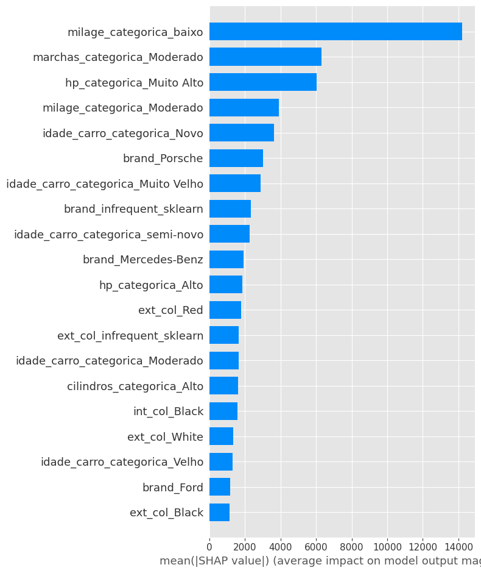

# Regression-of-Used-Car-Prices

## Objetivo

O objetivo desta competição é prever o preço de carros usados com base em vários atributos. Você deve criar um modelo que estime o preço de um carro dado um conjunto de características. O link para o conjunto de dados é [link](https://www.kaggle.com/competitions/playground-series-s4e9/overview)

## Avaliação
As submissões serão avaliadas com base na Raiz do Erro Quadrático Médio (RMSE). A fórmula para calcular o RMSE é a seguinte:


$$
\text{RMSE} = \sqrt{\frac{1}{N} \sum_{i=1}^{N} (y_i - \hat{y}_i)^2}
$$

Onde:

- `ŷ_i` é o valor previsto para a i-ésima instância
- `y_i` é o valor real para a i-ésima instância
- `N` é o número total de instâncias


## Arquivo de Submissão
Para cada ID no conjunto de teste, você deve prever o preço do carro. O arquivo de submissão deve conter um cabeçalho e seguir o formato abaixo:

```text
id,price
188533,43878.016
188534,43878.016
188535,43878.016
etc.
```

## Etapas

### Tratamento de Dados

**Foi aplicado os seguintes tratamentos ao conjunto de dados**

1. **Retirando IDs**
    - Remove a coluna `id` dos conjuntos de dados `train_x` e `test_x`.

2. **Criando a Coluna Cilindros**
    - Adiciona uma nova coluna representando o número de cilindros extraído dos dados da coluna `engine`.

3. **Criando a Coluna "HP"**
    - Cria uma coluna para a potência do motor (HP) extraída da coluna `engine`.

4. **Criando a Coluna "Marchas**
    - Adiciona uma coluna que representa o número de marchas do veículo extraído dos dados da coluna `transmission`.

5. **Criando a Coluna Idade dos Carros**
    - Cria uma coluna para a idade dos carros, calculada a partir dos dados da coluna `model_year`.

6. **Criando a Coluna Câmbio**
    - Adiciona uma coluna para o tipo de câmbio do veículo extraído dos dados da coluna `transmission`.

7. **Dropando Colunas**
    - Remove as colunas model, `model_year`, `model`, `engine`, `transmission` e `clean_title` dos conjuntos de dados.

8. **Imputação dos valores faltantes na Coluna Marchas"**
    - Preenche valores faltantes na coluna `marchas` utilizando um modelo de imputação treinado com as características `cambio`, `fuel_type`, `hp`, `idade_carro`,`cilindros`.

9. **Imputação dos valores faltantes na Coluna HP"**
    - Preenche valores faltantes na coluna `HP` utilizando um modelo de imputação treinado com as características `cambio`, `fuel_type`, `marchas`, `idade_carro`,`cilindros`.

10. **Imputação dos valores faltantes na Coluna cilindros"**
    - Preenche valores faltantes na coluna `cilindros` utilizando um modelo de imputação treinado com as características `cambio`, `fuel_type`, `marchas`, `idade_carro`,`HP`.

11. **Categorização das variaveis numericas**
    - Primeiro, a coluna `hp` (potência) é categorizada em quatro níveis: `Baixo`, `Médio`, `Alto` e `Muito Alto` com base em intervalos específicos.

    - A coluna `idade_carro` é dividida em cinco categorias: `Novo`, `semi-novo`, `Moderado`, `Velho` e `Muito Velho`, conforme os intervalos de idade do carro.

    - A coluna `milage` (quilometragem) é categorizada em quatro níveis: `baixo`, `Moderado`, `Alto`, e `Muito Alto`, baseando-se nos intervalos de quilometragem.

    - A coluna `cilindros` é categorizada em três níveis: `Baixo`, `Moderado` e `Alto`, de acordo com o número de cilindros do veículo.
    
    - A coluna `marchas` (número de marchas) é categorizada em três níveis: `Baixo`, `Moderado` e `Alto`.
12. **Dropando colunas**

    - Após a categorização, as colunas numéricas `hp`, `idade_carro`, `cilindros`, `marchas`, `milage` são removidas do conjunto de dados.

12. **Criando OneHot nas colunas categóricas**
    - As colunas categóricas são codificadas usando OneHot Encoding. A porcentagem de frequência para manter determinadas categorias é especificada.

No final a quantidade de dados para treino e teste e a seguinte:

- treino: `(150826, 68)`

- teste: `(37707, 68)`

### 
Principais Características

Utilizando a biblioteca [Shapley Additive exPlanations (SHAP)](https://shap.readthedocs.io/en/latest/), podemos identificar as variáveis mais importantes no modelo de regressão

Ao analisar o gráfico de `summary_plot`, observamos os seguintes insights:

1. **milage_categorica_baixo**: 
   - Essa categoria tem o maior impacto no modelo.
   - Carros com baixa quilometragem influenciam fortemente as previsões.

2. **marchas_categorica_Moderado**:
   - O número de marchas na categoria moderada (entre 4 e 6 marchas) também apresenta uma influência significativa.
   - Indica que a quantidade de marchas influencia o comportamento do modelo.

3. **hp_categorica_Muito Alto**:
   - Carros com potência muito alta (HP > 400) têm um impacto relevante nas previsões.
   - Sugere que veículos com alta potência são decisivos no modelo.

4. **milage_categorica_Moderado**:
   - A quilometragem moderada também afeta o modelo, mas menos que a baixa quilometragem.

5. **idade_carro_categorica_Novo**:
   - Carros novos (idade <= 3 anos) têm uma influência considerável, sugerindo que veículos mais novos são fatores relevantes.

6. **brand_Porsche**:
   - A marca Porsche é uma das variáveis mais influentes, o que é esperado devido ao valor agregado e características exclusivas desses veículos.

7. **idade_carro_categorica_Muito Velho**:
   - Carros muito antigos (idade > 15 anos) também têm impacto relevante, mostrando que a idade extrema do carro é um fator importante.

8. **brand_infrequent_sklearn**:
   - Marcas menos frequentes influenciam o modelo, indicando que veículos de marcas raras podem afetar as previsões.

9. **idade_carro_categorica_semi-novo**:
   - Carros semi-novos (entre 3 e 6 anos) têm um impacto moderado no modelo.

10. **brand_Mercedes-Benz**:
    - Carros da marca Mercedes-Benz também têm influência significativa, refletindo o prestígio associado à marca.

Este gráfico ajuda a visualizar o efeito de cada variável no modelo, ilustrando como diferentes características afetam o preço previsto de um veículo.


#


### Treinamento

Primeiramente, utilizei treze algoritmos para o treinamento com seus parâmetros padrão:

- `LinearRegression()`
- `DecisionTreeRegressor()`
- `RandomForestRegressor()`
- `GradientBoostingRegressor()`
- `CatBoostRegressor()`
- `keras.Sequential()`
- `SVR()`
- `SGDRegressor()`
- `KNeighborsRegressor()`
- `QuantileRegressor()`
- `RandomForestRegressor()`
- `HistGradientBoostingRegressor()`
- `LightGBM`

O modelo **LightGBM** apresentou o melhor desempenho geral, com o menor RMSE e MSE, e um MAE relativamente baixo, tornando-o a escolha mais confiável entre os modelos. **Redes Neurais** e **GradientBoosting** também se destacaram, embora tenham um desempenho ligeiramente inferior em precisão e explicação da variação dos dados.

**Linear Regression** teve um MAE significativamente alto, sugerindo previsões menos precisas. **RandomForest**, **SVR**, e **KNeighbors** tiveram desempenhos medianos, com erros mais altos e baixa capacidade explicativa (R² muito baixo).

**Decision Tree** e **Quantile** apresentaram resultados extremamente insatisfatórios, com o último indicando um erro de cálculo grave. Em resumo, **	LightGBM** é a melhor escolha, enquanto **	Quantile** e **Decision Tree** devem ser descartados.

<table border="1" class="dataframe">
  <thead>
    <tr style="text-align: right;">
      <th></th>
      <th>Model</th>
      <th>RMSE</th>
      <th>MSE</th>
      <th>MAE</th>
      <th>MAPE</th>
      <th>R2</th>
      <th>ExplainedVariance</th>
    </tr>
  </thead>
  <tbody>
    <tr>
      <th>11</th>
      <td>LightGBM</td>
      <td>84871.094410</td>
      <td>7.203103e+09</td>
      <td>21058.709389</td>
      <td>0.555438</td>
      <td>0.104325</td>
      <td>0.104434</td>
    </tr>
    <tr>
      <th>3</th>
      <td>GradientBoosting</td>
      <td>84895.561185</td>
      <td>7.207256e+09</td>
      <td>21154.666298</td>
      <td>0.566044</td>
      <td>0.103808</td>
      <td>0.103926</td>
    </tr>
    <tr>
      <th>6</th>
      <td>Redes_neurais</td>
      <td>84900.872259</td>
      <td>7.208158e+09</td>
      <td>20684.055870</td>
      <td>0.530414</td>
      <td>0.103696</td>
      <td>0.104073</td>
    </tr>
    <tr>
      <th>12</th>
      <td>HistGradient</td>
      <td>84929.142142</td>
      <td>7.212959e+09</td>
      <td>21049.514194</td>
      <td>0.560679</td>
      <td>0.103099</td>
      <td>0.103203</td>
    </tr>
    <tr>
      <th>0</th>
      <td>Linear</td>
      <td>85386.997148</td>
      <td>7.290939e+09</td>
      <td>22428.116132</td>
      <td>0.637301</td>
      <td>0.093402</td>
      <td>0.093499</td>
    </tr>
    <tr>
      <th>10</th>
      <td>SGDR</td>
      <td>85409.104479</td>
      <td>7.294715e+09</td>
      <td>22743.168242</td>
      <td>0.643956</td>
      <td>0.092933</td>
      <td>0.093074</td>
    </tr>
    <tr>
      <th>7</th>
      <td>XGBR</td>
      <td>86327.319263</td>
      <td>7.452406e+09</td>
      <td>21525.719846</td>
      <td>0.558529</td>
      <td>0.073325</td>
      <td>0.073414</td>
    </tr>
    <tr>
      <th>9</th>
      <td>CatBoost</td>
      <td>86504.879098</td>
      <td>7.483094e+09</td>
      <td>21337.214035</td>
      <td>0.555554</td>
      <td>0.069509</td>
      <td>0.069598</td>
    </tr>
    <tr>
      <th>5</th>
      <td>SVR</td>
      <td>89907.324314</td>
      <td>8.083327e+09</td>
      <td>24993.202450</td>
      <td>0.724653</td>
      <td>-0.005128</td>
      <td>0.020238</td>
    </tr>
    <tr>
      <th>4</th>
      <td>KNeighbors</td>
      <td>90028.142337</td>
      <td>8.105066e+09</td>
      <td>23710.958448</td>
      <td>0.588615</td>
      <td>-0.007831</td>
      <td>-0.007661</td>
    </tr>
    <tr>
      <th>2</th>
      <td>RandomForest</td>
      <td>90681.410577</td>
      <td>8.223118e+09</td>
      <td>23175.101501</td>
      <td>0.588044</td>
      <td>-0.022510</td>
      <td>-0.022490</td>
    </tr>
    <tr>
      <th>8</th>
      <td>Quantile</td>
      <td>90778.051736</td>
      <td>8.240655e+09</td>
      <td>27361.986395</td>
      <td>0.874857</td>
      <td>-0.024691</td>
      <td>0.000000</td>
    </tr>
    <tr>
      <th>1</th>
      <td>Decision_tree</td>
      <td>97344.824697</td>
      <td>9.476015e+09</td>
      <td>24590.451807</td>
      <td>0.620066</td>
      <td>-0.178303</td>
      <td>-0.178266</td>
    </tr>
  </tbody>
</table>


**Ranking dos Modelos**

O gráfico abaixo mostra quantas vezes cada modelo ficou em cada posição, através do ranqueamento da diferença entre sua predição e o valor real. O modelo **KNeighbors** foi o que mais vezes ficou em primeiro lugar, mas também ficou muitas vezes em penúltimo, demonstrando que ele é bastante inconsistente em suas predições. **LightGBM** e **HistGradient** se destacam como os modelos mais consistentes, frequentemente ocupando posições intermediárias e superiores, com poucas ocorrências nas últimas posições. **GradientBoosting** e **Redes Neurais** também apresentam um bom equilíbrio, mantendo-se nas posições medianas, sugerindo boa performance geral. Em contrapartida, **Linear** e **Quantile** frequentemente ocupam posições mais baixas, sendo os modelos frequentemente classificados em penúltimo lugar. **SVR** e **KNeighbors** têm um desempenho mediano, com posições distribuídas de forma equilibrada, mas raramente nas primeiras colocações. No geral, **LightGBM** e **HistGradient** são as escolhas mais confiáveis, enquanto **KNeighbors** tem o pior desempenho.


### Referências

@misc{playground-series-s4e9,
    author = {Walter Reade, Ashley Chow},
    title = {Regression of Used Car Prices},
    publisher = {Kaggle},
    year = {2024},
    url = {https://kaggle.com/competitions/playground-series-s4e9}
}
