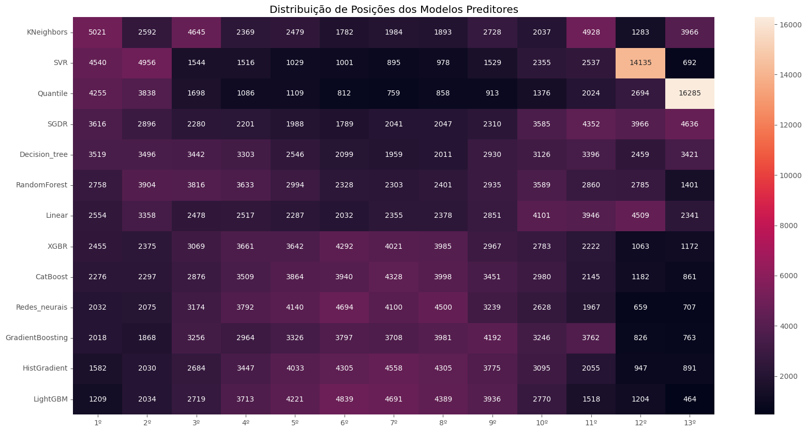

# Regression-of-Used-Car-Prices

## Objetivo

O objetivo desta competição é prever o preço de carros usados com base em vários atributos. Você deve criar um modelo que estime o preço de um carro dado um conjunto de características. O link para o conjunto de dados é [link](https://www.kaggle.com/competitions/playground-series-s4e9/overview)

## Avaliação
As submissões serão avaliadas com base na Raiz do Erro Quadrático Médio (RMSE). A fórmula para calcular o RMSE é a seguinte:


$$
\text{RMSE} = \sqrt{\frac{1}{N} \sum_{i=1}^{N} (y_i - \hat{y}_i)^2}
$$

Onde:

- `ŷ_i` é o valor previsto para a i-ésima instância
- `y_i` é o valor real para a i-ésima instância
- `N` é o número total de instâncias


## Arquivo de Submissão
Para cada ID no conjunto de teste, você deve prever o preço do carro. O arquivo de submissão deve conter um cabeçalho e seguir o formato abaixo:

```text
id,price
188533,43878.016
188534,43878.016
188535,43878.016
etc.
```

## Etapas

### Tratamento de Dados

**Foi aplicado os seguintes tratamentos ao conjunto de dados**

1. **Retirando IDs**
    - Remove a coluna `id` dos conjuntos de dados `train_x` e `test_x`.

2. **Criando a Coluna Cilindros**
    - Adiciona uma nova coluna representando o número de cilindros extraído dos dados da coluna `engine`.

3. **Criando a Coluna "HP"**
    - Cria uma coluna para a potência do motor (HP) extraída da coluna `engine`.

4. **Criando a Coluna "Marchas**
    - Adiciona uma coluna que representa o número de marchas do veículo extraído dos dados da coluna `transmission`.

5. **Criando a Coluna Idade dos Carros**
    - Cria uma coluna para a idade dos carros, calculada a partir dos dados da coluna `model_year`.

6. **Criando a Coluna Câmbio**
    - Adiciona uma coluna para o tipo de câmbio do veículo extraído dos dados da coluna `transmission`.

7. **Dropando Colunas**
    - Remove as colunas model, `model_year`, `model`, `engine`, `transmission` e `clean_title` dos conjuntos de dados.

8. **Imputação dos valores faltantes na Coluna Marchas"**
    - Preenche valores faltantes na coluna `marchas` utilizando um modelo de imputação treinado com as características `cambio`, `fuel_type`, `hp`, `idade_carro`,`cilindros`.

9. **Imputação dos valores faltantes na Coluna HP"**
    - Preenche valores faltantes na coluna `HP` utilizando um modelo de imputação treinado com as características `cambio`, `fuel_type`, `marchas`, `idade_carro`,`cilindros`.

10. **Imputação dos valores faltantes na Coluna cilindros"**
    - Preenche valores faltantes na coluna `cilindros` utilizando um modelo de imputação treinado com as características `cambio`, `fuel_type`, `marchas`, `idade_carro`,`HP`.

11. **One-Hot Encoding para Colunas Categóricas**
    - Aplicamos One-Hot Encoding para as colunas categóricas com uma frequência mínima de especificada para cada coluna, criando novas colunas para categorias pouco frequentes.

12. **Transformando as Colunas Numericas**

    **Cada coluna foi transformada com um metodo diferente:**
    - `milage`: `BoxCoxTransformer`
    - `Cilindros`: `StandardScaler`
    - `HP`: `BoxCoxTransformer`
    - `idade_carro`: `YeoJohnsonTransformer`
    - `marchas`: `MinMaxScaler`
    
Após todo os tratamentos os conjuntos de dados ficaram com os seguintes tamanhos:

- treino: `(150826, 53)`

- teste: `(37707, 53)`

### Principais Características

Utilizando a biblioteca [Shapley Additive exPlanations (SHAP)](https://shap.readthedocs.io/en/latest/), podemos identificar as variáveis mais importantes no modelo de regressão, com destaque para as variáveis `milage`, `hp`, `idade_carro`, `brand_Porsche`, e `brand_Land`.

Ao analisar o gráfico de `summary_plot`, observamos os seguintes insights:

- **`milage` (quilometragem)**: Valores **baixos** de quilometragem (em azul) têm um impacto **positivo** nas previsões, enquanto valores **altos** (em vermelho) impactam **negativamente**. Isso indica que carros com quilometragem mais alta tendem a ter preços **mais baixos**, enquanto veículos com baixa quilometragem são avaliados com preços **mais altos**.

- **`hp` (potência)**: Valores **altos** de potência estão associados a impactos **positivos** nas previsões, sugerindo que carros com mais potência são, em geral, previstos com preços **mais altos**.

- **`idade_carro` (idade do carro)**: Carros mais antigos (em vermelho) têm um impacto **negativo** no valor previsto, enquanto carros mais novos (em azul) têm um efeito **positivo**, o que é esperado, já que veículos mais novos geralmente possuem maior valor de mercado.

- **`brand_Porsche`**: A marca Porsche tem um impacto **fortemente positivo** nas previsões, indicando que os carros dessa marca são frequentemente associados a preços **mais elevados**, como esperado, dado o prestígio e o alto custo dos veículos Porsche.

- **`cambio_manual`**: Veículos com câmbio manual parecem ter um impacto **negativo** nas previsões, sugerindo que carros com câmbio manual são frequentemente avaliados com preços **mais baixos** em comparação com aqueles com câmbio automático ou dual.

- **`accident_At least 1 accident or damage reported` (acidente/dano reportado)**: Como esperado, a presença de acidentes ou danos reportados (valores em vermelho) tem um impacto **negativo** significativo, diminuindo o valor previsto do carro. Isso reflete a percepção de que carros com histórico de acidentes ou danos tendem a ser desvalorizados.

Este gráfico ajuda a visualizar o efeito de cada variável no modelo, ilustrando como diferentes características afetam o preço previsto de um veículo.


### Treinamento

Primeiramente, utilizei onze algoritmos para o treinamento com seus parâmetros padrão:

- `LinearRegression()`
- `DecisionTreeRegressor()`
- `RandomForestRegressor()`
- `GradientBoostingRegressor()`
- `CatBoostRegressor()`
- `keras.Sequential()`
- `SVR()`
- `SGDRegressor()`
- `KNeighborsRegressor()`
- `QuantileRegressor()`
- `RandomForestRegressor()`

O modelo **GradientBoosting** apresentou o melhor desempenho geral, com o menor RMSE e MSE, e um MAE relativamente baixo, tornando-o a escolha mais confiável entre os modelos. **Redes Neurais** e **CatBoost** também se destacaram, embora tenham um desempenho ligeiramente inferior em precisão e explicação da variação dos dados.

**Linear Regression** teve um MAE significativamente alto, sugerindo previsões menos precisas. **RandomForest**, **SVR**, e **KNeighbors** tiveram desempenhos medianos, com erros mais altos e baixa capacidade explicativa (R² muito baixo).

**Decision Tree** e **SGDR** apresentaram resultados extremamente insatisfatórios, com o último indicando um erro de cálculo grave. Em resumo, **GradientBoosting** é a melhor escolha, enquanto **SGDR** e **Decision Tree** devem ser descartados.

<table border="1" class="dataframe">
  <thead>
    <tr style="text-align: right;">
      <th></th>
      <th>Model</th>
      <th>RMSE</th>
      <th>MSE</th>
      <th>MAE</th>
      <th>MAPE</th>
      <th>R2</th>
      <th>ExplainedVariance</th>
    </tr>
  </thead>
  <tbody>
    <tr>
      <th>3</th>
      <td>GradientBoosting</td>
      <td>84577.95</td>
      <td>7153429816.57</td>
      <td>20403.63</td>
      <td>0.53</td>
      <td>0.11</td>
      <td>0.11</td>
    </tr>
    <tr>
      <th>6</th>
      <td>Redes_neurais</td>
      <td>85502.12</td>
      <td>7310612256.56</td>
      <td>21152.99</td>
      <td>0.48</td>
      <td>0.09</td>
      <td>0.10</td>
    </tr>
    <tr>
      <th>0</th>
      <td>Linear</td>
      <td>85654.74</td>
      <td>7336734695.69</td>
      <td>23432.51</td>
      <td>0.74</td>
      <td>0.09</td>
      <td>0.09</td>
    </tr>
    <tr>
      <th>9</th>
      <td>CatBoost</td>
      <td>86210.56</td>
      <td>7432261244.01</td>
      <td>20579.82</td>
      <td>0.52</td>
      <td>0.08</td>
      <td>0.08</td>
    </tr>
    <tr>
      <th>7</th>
      <td>XGBR</td>
      <td>86510.40</td>
      <td>7484048894.24</td>
      <td>20853.33</td>
      <td>0.53</td>
      <td>0.07</td>
      <td>0.07</td>
    </tr>
    <tr>
      <th>8</th>
      <td>Quantile</td>
      <td>87247.60</td>
      <td>7612143629.71</td>
      <td>20809.65</td>
      <td>0.51</td>
      <td>0.05</td>
      <td>0.07</td>
    </tr>
    <tr>
      <th>5</th>
      <td>SVR</td>
      <td>88525.66</td>
      <td>7836792869.53</td>
      <td>22057.49</td>
      <td>0.54</td>
      <td>0.03</td>
      <td>0.05</td>
    </tr>
    <tr>
      <th>2</th>
      <td>RandomForest</td>
      <td>88606.14</td>
      <td>7851048450.30</td>
      <td>22298.04</td>
      <td>0.56</td>
      <td>0.02</td>
      <td>0.02</td>
    </tr>
    <tr>
      <th>4</th>
      <td>KNeighbors</td>
      <td>89134.08</td>
      <td>7944884106.39</td>
      <td>23171.82</td>
      <td>0.57</td>
      <td>0.01</td>
      <td>0.01</td>
    </tr>
    <tr>
      <th>1</th>
      <td>Decision_tree</td>
      <td>115366.31</td>
      <td>13309385281.26</td>
      <td>28740.35</td>
      <td>0.70</td>
      <td>-0.65</td>
      <td>-0.65</td>
    </tr>
    <tr>
      <th>10</th>
      <td>SGDR</td>
      <td>487363997117125312.00</td>
      <td>237523665685981347699930809092800512.00</td>
      <td>387990650036058944.00</td>
      <td>27434527821995.32</td>
      <td>-29535066995239774792450048.00</td>
      <td>-10816457118337098342989824.00</td>
    </tr>
  </tbody>
</table>
</div>

**Ranking dos Modelos**

O gráfico abaixo mostra quantas vezes cada modelo ficou em cada posição, através do ranqueamento da diferença entre sua predição e o valor real. 

- O modelo **Decision Tree** foi o que mais vezes ficou em primeiro lugar, mas também ficou muitas vezes em penúltimo, demonstrando que ele é bastante inconsistente em suas predições. 

- **GradientBoosting** e **CatBoost** se destacam como os modelos mais consistentes, frequentemente ocupando posições intermediárias e superiores, com poucas ocorrências nas últimas posições. 

- **RandomForest** e **XGBR** também apresentam um bom equilíbrio, mantendo-se nas posições medianas, sugerindo boa performance geral. Em contrapartida, 
- **Linear** frequentemente ocupa posições mais baixas, sendo o modelo frequentemente classificado em penúltimo lugar. 

- **Redes Neurais**, **SVR** e **KNeighbors** têm um desempenho mediano, com posições distribuídas de forma equilibrada, mas raramente nas primeiras colocações. 

- **Quantile** apresenta uma variação significativa, ficando tanto nas melhores quanto nas piores posições.

- No final, **GradientBoosting** e **CatBoost** são as escolhas mais confiáveis, enquanto **Decision Tree** tem o pior desempenho.




Para a tunagem dos hiperparametros selecionarei os modelos:

- **GradientBoosting**
- **CatBoost**
- **Redes Neurais**
- **XGBR**

Os hiperparametros escolhidos para cada modelo foram os seguintes:

- **GradientBoosting**:
  - `n_estimators`: 70
  - `max_features`: 10
  - `max_depth`: 2
  - `learning_rate`: 0.2
  - `criterion`: `squared_error`	

- **CatBoost**
  - `learning_rate`: 0.8
  - `l2_leaf_reg`: 7
  - `iterations`: 50
  - `depth`: 5

- **XGBR**
  - `n_estimators`: 50
  - `max_features`: 6
  - `max_depth`: 70
  - `criterion`: `absolute_error`

- **Redes Neurais**
  ```text
  Model: "sequential"
  ┏━━━━━━━━━━━━━━━━━━━━━━━━━━━━━━━━━┳━━━━━━━━━━━━━━━━━━━━━━━━┳━━━━━━━━━━━━━━━┓
  ┃ Layer (type)                    ┃ Output Shape           ┃       Param # ┃
  ┡━━━━━━━━━━━━━━━━━━━━━━━━━━━━━━━━━╇━━━━━━━━━━━━━━━━━━━━━━━━╇━━━━━━━━━━━━━━━┩
  │ dense (Dense)                   │ (None, 32)             │         1,728 │
  ├─────────────────────────────────┼────────────────────────┼───────────────┤
  │ dense_1 (Dense)                 │ (None, 32)             │         1,056 │
  ├─────────────────────────────────┼────────────────────────┼───────────────┤
  │ dense_2 (Dense)                 │ (None, 32)             │         1,056 │
  ├─────────────────────────────────┼────────────────────────┼───────────────┤
  │ dense_3 (Dense)                 │ (None, 32)             │         1,056 │
  ├─────────────────────────────────┼────────────────────────┼───────────────┤
  │ dense_4 (Dense)                 │ (None, 32)             │         1,056 │
  ├─────────────────────────────────┼────────────────────────┼───────────────┤
  │ dense_5 (Dense)                 │ (None, 1)              │            33 │
  └─────────────────────────────────┴────────────────────────┴───────────────┘

### Avaliação dos Modelos

### Análise dos Modelos Treinados

1. **Gradiente Boost Tunado:** Melhor desempenho em MAE (20,774.68) e MAPE (0.55), com R² de 0.11. É o mais eficiente para previsões individuais.
2. **CatBoost Tunado:** Resultados próximos ao Gradiente Boost, com MAE de 20,685.72 e MAPE de 0.53. Explicabilidade semelhante com R² de 0.10.
3. **Random Forest Tunado:** Pior RMSE (86,644.89) e MSE, mas o menor MAPE (0.51), indicando maior precisão relativa, embora com baixa explicação (R² de 0.07).
4. **Redes Neurais Tunado:** MAE mais alto (21,437.62) e desempenho intermediário em RMSE, com R² de 0.09 e Explained Variance de 0.10.
5. **Conclusão:** Gradiente Boost é o melhor para previsões individuais, enquanto Random Forest pode ser útil onde a precisão percentual é mais importante.


<table border="1" class="dataframe">
  <thead>
    <tr style="text-align: right;">
      <th></th>
      <th>Model</th>
      <th>RMSE</th>
      <th>MSE</th>
      <th>MAE</th>
      <th>MAPE</th>
      <th>R2</th>
      <th>ExplainedVariance</th>
    </tr>
  </thead>
  <tbody>
    <tr>
      <th>0</th>
      <td>gradiente_boost_tunado</td>
      <td>84718.02</td>
      <td>7177142338.58</td>
      <td>20774.68</td>
      <td>0.55</td>
      <td>0.11</td>
      <td>0.11</td>
    </tr>
    <tr>
      <th>1</th>
      <td>cat_boost_tunado</td>
      <td>84938.16</td>
      <td>7214490373.20</td>
      <td>20685.72</td>
      <td>0.53</td>
      <td>0.10</td>
      <td>0.10</td>
    </tr>
    <tr>
      <th>3</th>
      <td>redes_neurais_tunado</td>
      <td>85405.27</td>
      <td>7294060817.89</td>
      <td>21437.62</td>
      <td>0.52</td>
      <td>0.09</td>
      <td>0.10</td>
    </tr>
    <tr>
      <th>2</th>
      <td>random_forest_tunado</td>
      <td>86644.89</td>
      <td>7507337584.81</td>
      <td>20929.72</td>
      <td>0.51</td>
      <td>0.07</td>
      <td>0.07</td>
    </tr>
  </tbody>
</table>
</div>

### Referências

@misc{playground-series-s4e9,
    author = {Walter Reade, Ashley Chow},
    title = {Regression of Used Car Prices},
    publisher = {Kaggle},
    year = {2024},
    url = {https://kaggle.com/competitions/playground-series-s4e9}
}
